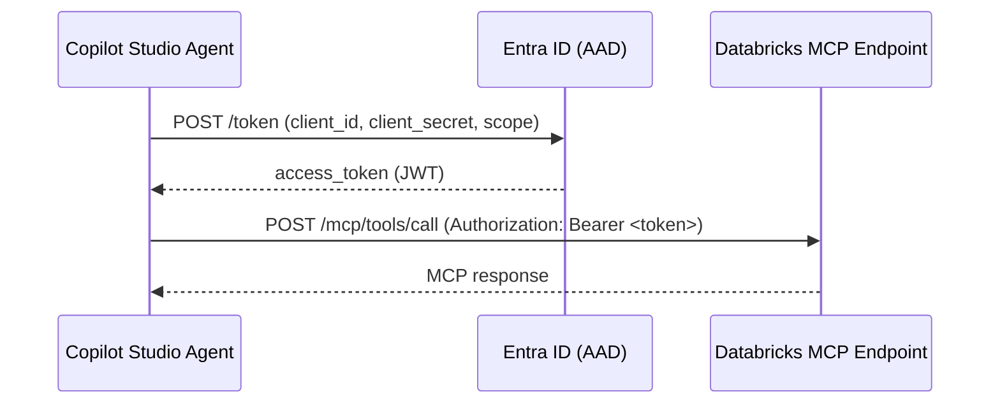

# Pattern: OAuth 2.0 Client Credentials Authentication

## Pattern Statement

A Copilot Studio agent authenticates to a Databricks MCP endpoint as an application (service principal) using the OAuth 2.0 client credentials grant, with no user delegation.

## Architecture Diagram

## Required Components

| Component | Role |
|-----------|------|
| [component-pp-auth-models](../../10-components/power-platform/component-pp-auth-models.md) | Power Platform OAuth configuration |
| [component-dbx-auth](../../10-components/databricks/component-dbx-auth.md) | Databricks service principal setup |
| [component-oob-connector-behavior](../../10-components/connectors/component-oob-connector-behavior.md) or [component-custom-connector-auth](../../10-components/connectors/component-custom-connector-auth.md) | Connector auth configuration |

## Variations

- **Secret vs. certificate**: Client secret is simpler; certificate (client assertion) is more secure. TODO: confirm certificate support in Power Platform custom connectors.
- **APIM token injection**: In the [pattern-private-via-apim](../connectivity/pattern-private-via-apim.md) topology, APIM acquires the Databricks token on behalf of Power Platform, and Power Platform authenticates to APIM separately.

## Constraints / Non-Goals

- No user identity is passed to Databricks; Databricks sees the service principal, not the end user.
- Not suitable when row-level security in Databricks must be enforced per-user.
- Client secret must be rotated; there is no automatic rotation in Power Platform connector connections.

## Validation Checklist

- [ ] Entra ID app registration exists with the Databricks API permission added.
- [ ] Service principal is added to the Databricks workspace with appropriate roles.
- [ ] Token request to Entra ID returns a valid JWT (`access_token` present in response).
- [ ] JWT `aud` claim matches the expected Databricks resource ID. TODO: confirm expected `aud`.
- [ ] Connector test call to Databricks returns HTTP 200 (not 401/403).
- [ ] Token refresh (after expiry) succeeds without manual intervention.
