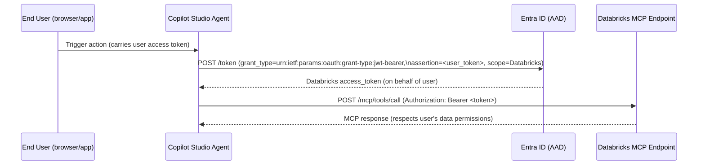

# Pattern: OAuth 2.0 On-Behalf-Of (OBO) / Delegated Authentication

## Pattern Statement

A Copilot Studio agent passes the signed-in user's identity to Databricks using the OAuth 2.0 On-Behalf-Of (OBO) grant, so that Databricks can enforce per-user access controls.

## Architecture Diagram

## Required Components

| Component | Role |
|-----------|------|
| [component-pp-auth-models](../../10-components/power-platform/component-pp-auth-models.md) | Power Platform OAuth OBO configuration |
| [component-dbx-auth](../../10-components/databricks/component-dbx-auth.md) | Databricks user/group permission setup |
| [component-custom-connector-auth](../../10-components/connectors/component-custom-connector-auth.md) | Custom connector with OBO flow (typically required) |

## Variations

- **Copilot Studio**: User signs in to the agent; their token can be passed through the OBO flow, though user identity may not be available in all invocation contexts. TODO: confirm Copilot Studio OBO support.
- **APIM-mediated OBO**: APIM performs the OBO token exchange, offloading it from the connector. TODO: confirm APIM OBO policy pattern.

## Constraints / Non-Goals

- Requires the user to have been granted access in both Entra ID (app consent) and the Databricks workspace.
- Not available in background (non-interactive) flows where no user token is present; use [pattern-oauth-client-credentials](pattern-oauth-client-credentials.md) instead.
- OBO requires the intermediate service (Power Platform / APIM) to be registered in Entra ID with `/.default` or explicit Databricks permissions. TODO: confirm required permissions.
- OBO token exchange requires the user's token to have the correct audience; misconfigured connectors will fail silently. TODO: confirm troubleshooting approach.

## Validation Checklist

- [ ] Entra ID app registration has the Databricks API delegated permission added and admin consent granted.
- [ ] User has been granted access to the Databricks workspace (directly or via group).
- [ ] OBO token exchange returns a valid Databricks-scoped JWT.
- [ ] JWT `oid` claim corresponds to the expected user in Databricks.
- [ ] Databricks enforces row-level security / access control based on the user identity.
- [ ] Connector test (as a specific user) returns HTTP 200 and only the data the user is permitted to see.

## Related

- [pattern-oauth-client-credentials](pattern-oauth-client-credentials.md)
- [component-pp-auth-models](../../10-components/power-platform/component-pp-auth-models.md)
