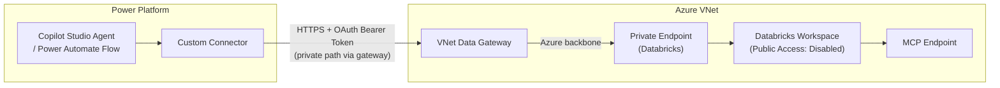

# Pattern: Private End-to-End Connectivity

## Pattern Statement

Power Platform connects to a Databricks MCP endpoint entirely within an Azure VNet using a VNet data gateway and Private Endpoint, with no traffic traversing the public internet.

## Architecture Diagram

## Required Components

| Component | Role |
|-----------|------|
| [component-pp-networking](../../10-components/power-platform/component-pp-networking.md) | VNet data gateway configuration |
| [component-pp-auth-models](../../10-components/power-platform/component-pp-auth-models.md) | OAuth token acquisition |
| [component-custom-connector-auth](../../10-components/connectors/component-custom-connector-auth.md) | Custom connector (typically required for private path) |
| [component-public-vs-private](../../10-components/networking/component-public-vs-private.md) | Private Endpoint and DNS configuration |
| [component-dbx-auth](../../10-components/databricks/component-dbx-auth.md) | Databricks authentication |

## Variations

- **OOB connector + private path**: May be possible if the OOB connector supports VNet data gateway routing. TODO: confirm OOB support.
- **mcpsql vs. mcpgenie**: Swap the Databricks endpoint component; no change to the connectivity pattern.

## Constraints / Non-Goals

- Requires VNet data gateway deployment; adds infrastructure cost and maintenance.
- Does not include APIM; see [pattern-private-via-apim](pattern-private-via-apim.md) if a proxy layer is needed.
- Management plane access to Databricks (Azure portal, Terraform) must also use the private path when public access is disabled.

## Validation Checklist

- [ ] Private Endpoint for Databricks is provisioned and in "Succeeded" state.
- [ ] Private DNS zone `privatelink.azuredatabricks.net` resolves to the Private Endpoint IP from within the VNet.
- [ ] VNet data gateway is registered in Power Platform admin center and shows "Online".
- [ ] Connector is configured to use the VNet data gateway.
- [ ] Connector test returns HTTP 200 from the MCP endpoint.
- [ ] Databricks public network access is disabled (optional hardening step).

## Related Config Paths

- [config-03-pp-oob-private-dbx-genie](../../30-config-paths/config-03-pp-oob-private-dbx-genie.md)
