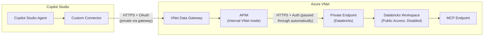

# Pattern: Private Connectivity via APIM

## Pattern Statement

A Copilot Studio agent connects to a Databricks MCP endpoint through an Azure API Management (APIM) instance deployed inside an Azure VNet, providing centralized policy enforcement, authentication mediation, and private network isolation.

## Architecture Diagram

## Required Components

| Component | Role |
|-----------|------|
| [component-pp-networking](../../10-components/power-platform/component-pp-networking.md) | VNet data gateway configuration |
| [component-pp-auth-models](../../10-components/power-platform/component-pp-auth-models.md) | OAuth token acquisition (PP → APIM) |
| [component-custom-connector-auth](../../10-components/connectors/component-custom-connector-auth.md) | Custom connector pointing to APIM URL |
| [component-public-vs-private](../../10-components/networking/component-public-vs-private.md) | Private Endpoint and DNS configuration |
| [component-apim-private-ingress-egress](../../10-components/apim/component-apim-private-ingress-egress.md) | APIM VNet integration |
| [component-apim-mcp-proxy-basics](../../10-components/apim/component-apim-mcp-proxy-basics.md) | APIM MCP API definition and policies |
| [component-dbx-auth](../../10-components/databricks/component-dbx-auth.md) | Databricks authentication (managed by APIM) |

## Variations

- **Auth mediation**: Authentication to Databricks is handled automatically through the OAuth flow — no additional APIM policy configuration is required to inject or manage Databricks tokens.
- **Multiple backends**: APIM can route to both `mcpsql` and `mcpgenie` based on the request path or header, allowing a single connector to reach both endpoints.
- **Policy-only APIM**: APIM External mode can be used if Power Platform cannot route to an APIM Internal endpoint; reduces privacy guarantees.

## Constraints / Non-Goals

- APIM adds cost (Developer SKU minimum for VNet integration; Standard/Premium for production).
- This pattern does not cover APIM self-hosted gateway scenarios.

## Validation Checklist

- [ ] APIM is deployed in Internal VNet mode and shows "Online" in the Azure portal.
- [ ] APIM backend health check to Databricks Private Endpoint returns success.
- [ ] APIM test console call to MCP operation returns HTTP 200.
- [ ] VNet data gateway can reach APIM internal IP.
- [ ] Custom connector (pointing to APIM URL) test returns HTTP 200.
- [ ] End-to-end call from Copilot Studio agent returns expected MCP response.
- [ ] Databricks audit log shows the call originated from the APIM service principal.

## Related Config Paths

- [config-02-pp-custom-private-apim-dbx-sql](../../30-config-paths/config-02-pp-custom-private-apim-dbx-sql.md)
