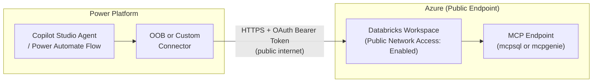

# Pattern: Public Direct Connectivity

## Pattern Statement

Power Platform connects to a Databricks MCP endpoint over the public internet using an OOB or custom connector, with OAuth 2.0 authentication and no private networking infrastructure.

## Architecture Diagram

## Required Components

| Component | Role |
|-----------|------|
| [component-pp-networking](../../10-components/power-platform/component-pp-networking.md) | Power Platform outbound connectivity |
| [component-pp-auth-models](../../10-components/power-platform/component-pp-auth-models.md) | OAuth token acquisition |
| [component-oob-connector-behavior](../../10-components/connectors/component-oob-connector-behavior.md) or [component-custom-connector-auth](../../10-components/connectors/component-custom-connector-auth.md) | Connector |
| [component-public-vs-private](../../10-components/networking/component-public-vs-private.md) | Network path |
| [component-dbx-auth](../../10-components/databricks/component-dbx-auth.md) | Databricks authentication |

## Variations

- **OOB connector**: Simplest setup; limited customization.
- **Custom connector**: More control over request/response; required if OOB is insufficient.
- **mcpsql vs. mcpgenie**: Swap the Databricks endpoint component; no change to the connectivity pattern.

## Constraints / Non-Goals

- This pattern does **not** provide network-layer isolation; traffic transits the public internet.
- Not suitable for organizations with policies prohibiting public internet egress for data traffic.
- APIM is not in scope for this pattern; see [pattern-private-via-apim](pattern-private-via-apim.md) if a gateway is needed.

## Validation Checklist

- [ ] Databricks workspace has public network access enabled.
- [ ] Power Platform outbound IPs are allowed by any Databricks IP access list.
- [ ] OAuth token is successfully acquired (no 401 on connector test).
- [ ] Connector test returns HTTP 200 from the MCP endpoint.
- [ ] DLP policy in Power Platform does not block the connector.

## Related Config Paths

- [config-01-pp-oob-public-dbx-genie](../../30-config-paths/config-01-pp-oob-public-dbx-genie.md)
