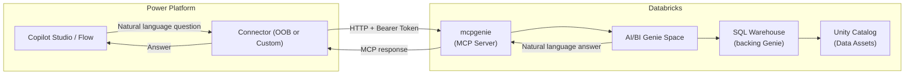

# Pattern: Databricks MCP Genie (mcpgenie)

## Pattern Statement

A Power Platform connector sends natural-language questions to a Databricks AI/BI Genie Space using the MCP Genie endpoint (`mcpgenie`), authenticated via OAuth 2.0 client credentials.

## Architecture Diagram

## Required Components

| Component | Role |
|-----------|------|
| [component-dbx-mcpgenie](../../10-components/databricks/component-dbx-mcpgenie.md) | mcpgenie endpoint configuration |
| [component-dbx-auth](../../10-components/databricks/component-dbx-auth.md) | Databricks authentication |
| [component-pp-auth-models](../../10-components/power-platform/component-pp-auth-models.md) | Power Platform OAuth |
| [component-oob-connector-behavior](../../10-components/connectors/component-oob-connector-behavior.md) or [component-custom-connector-auth](../../10-components/connectors/component-custom-connector-auth.md) | Connector |
| [component-public-vs-private](../../10-components/networking/component-public-vs-private.md) | Network path (select public or private) |

## Variations

- **Public path**: Use [pattern-public-direct](../connectivity/pattern-public-direct.md).
- **Private path**: Use [pattern-private-end-to-end](../connectivity/pattern-private-end-to-end.md) or [pattern-private-via-apim](../connectivity/pattern-private-via-apim.md).
- **Multiple Genie Spaces**: Different Genie Space IDs can be used for different domains (sales, finance, etc.) by parameterizing the endpoint URL.

## Constraints / Non-Goals

- Response quality depends on the Genie Space configuration (data assets, curated questions, instructions).
- Genie is not a deterministic SQL engine; the same question may produce slightly different SQL across calls.
- Requires Unity Catalog enabled on the workspace. TODO: confirm.
- Not suitable for precise, deterministic queries where exact SQL control is needed — use [pattern-dbx-mcp-sql](pattern-dbx-mcp-sql.md) instead.

## Validation Checklist

- [ ] Genie Space exists and is accessible by the service principal.
- [ ] MCP `tools/list` returns the Genie ask-question tool.
- [ ] MCP `tools/call` with a sample question returns a meaningful natural-language answer.
- [ ] Token is accepted (no 401/403).
- [ ] End-to-end call from Copilot Studio agent / Power Automate flow returns expected answer.
- [ ] Genie Space query history confirms the question was processed.

## Related Config Paths

- [config-01-pp-oob-public-dbx-genie](../../30-config-paths/config-01-pp-oob-public-dbx-genie.md)
- [config-03-pp-oob-private-dbx-genie](../../30-config-paths/config-03-pp-oob-private-dbx-genie.md)
