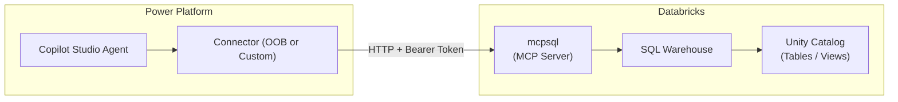

# Pattern: Databricks MCP SQL (mcpsql)

## Pattern Statement

A Power Platform connector queries structured data in a Databricks SQL Warehouse using the MCP SQL endpoint (`mcpsql`), authenticated via OAuth 2.0 client credentials.

## Architecture Diagram

## Required Components

| Component | Role |
|-----------|------|
| [component-dbx-mcpsql](../../10-components/databricks/component-dbx-mcpsql.md) | mcpsql endpoint configuration |
| [component-dbx-auth](../../10-components/databricks/component-dbx-auth.md) | Databricks authentication |
| [component-pp-auth-models](../../10-components/power-platform/component-pp-auth-models.md) | Power Platform OAuth |
| [component-oob-connector-behavior](../../10-components/connectors/component-oob-connector-behavior.md) or [component-custom-connector-auth](../../10-components/connectors/component-custom-connector-auth.md) | Connector |
| [component-public-vs-private](../../10-components/networking/component-public-vs-private.md) | Network path (select public or private) |

## Variations

- **Public path**: Use [pattern-public-direct](../connectivity/pattern-public-direct.md).
- **Private path**: Use [pattern-private-end-to-end](../connectivity/pattern-private-end-to-end.md) or [pattern-private-via-apim](../connectivity/pattern-private-via-apim.md).
- **OBO auth**: Replace client credentials with [pattern-oauth-obo](../authentication/pattern-oauth-obo.md) when per-user data access control is needed.

## Constraints / Non-Goals

- The SQL Warehouse must be running; cold-start latency applies.
- Result sets are bounded by Databricks MCP server limits. TODO: confirm result size limit.
- This pattern covers read operations; write operations via MCP SQL are TODO: confirm support.

## Validation Checklist

- [ ] SQL Warehouse is running and accessible by the service principal.
- [ ] MCP `tools/list` returns the expected SQL tools.
- [ ] MCP `tools/call` with a test query returns correct data.
- [ ] Token is accepted (no 401/403).
- [ ] End-to-end call from Copilot Studio agent returns expected result.

## Related Config Paths

- [config-02-pp-custom-private-apim-dbx-sql](../../30-config-paths/config-02-pp-custom-private-apim-dbx-sql.md)
